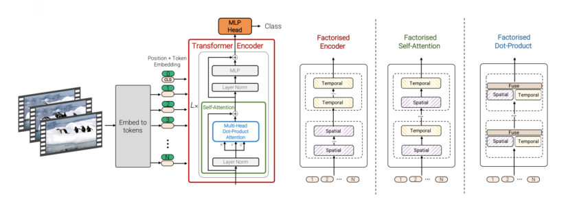
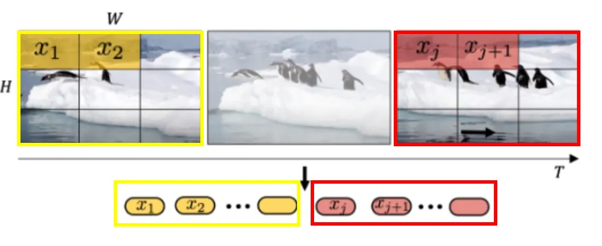
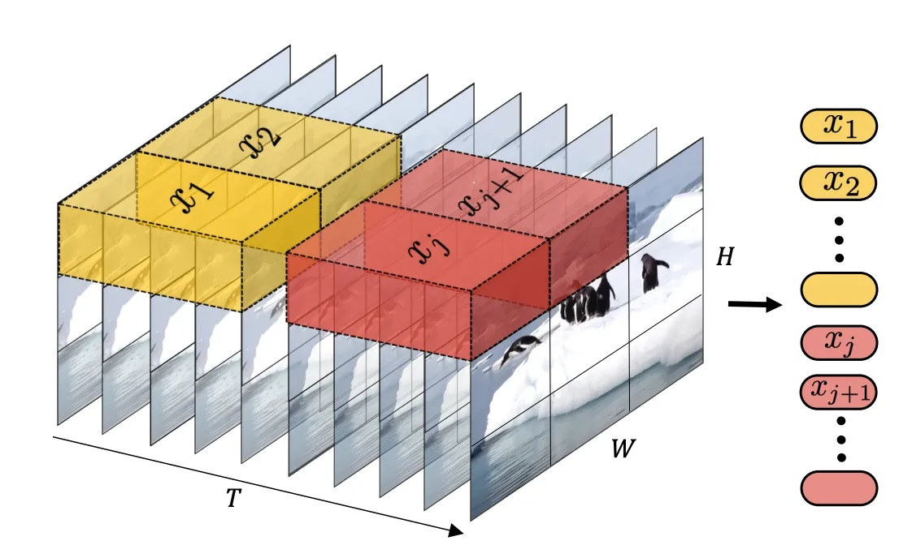
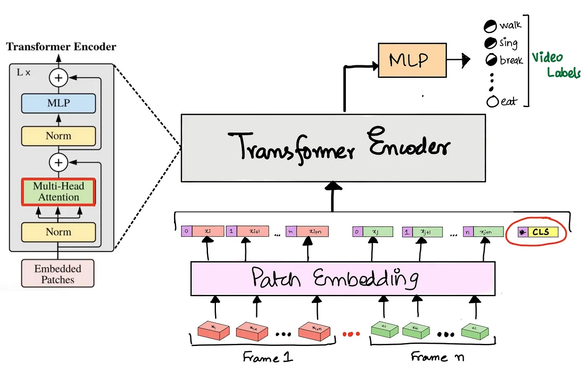
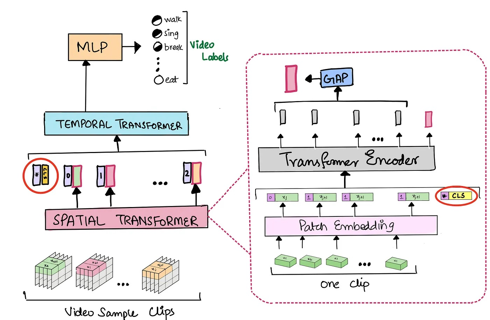
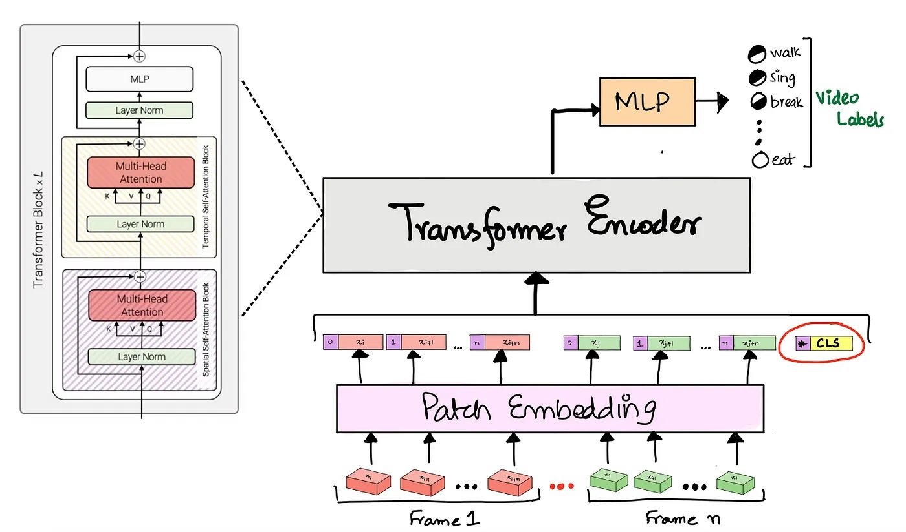
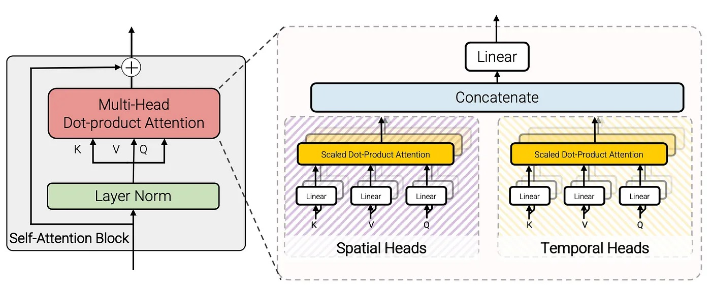

# DERİN ÖĞRENME TEKNİĞİ İLE SALDIRGANLIK TESPİTİ
## Projenin Tanıtımı
Saldırganlık tespiti, video görüntülerinde insanların hareketlerini gözlemleyerek şiddet içeren bir 
tavır içinde olup olmadıklarının tespit edilmesidir. Bu tespit için denetimli derin öğrenme modeli 
kullanılması amaçlanmıştır. Yöntem olarak da video sınıflandırma (video classification) yöntemi 
kullanılacaktır. Bu doğrultuda birkaç tane derin öğrenme modeli deneyimlenmiş olup niyahetinde 
Video Vision Transformer modeli kullanılmasına karar verilmiştir. 
### Derin Öğrenme
Derin öğrenme (deep learning), yapay sinir ağlarından oluşan derin ve karmaşık model yapılarının 
kullanıldığı bir makine öğrenmesi alt dalıdır. Derin öğrenme, büyük veri setlerinden örüntüler ve 
ilişkiler çıkararak karmaşık problemleri çözmeyi amaçlar.
#### Denetimli Öğrenme (Supervised Learning)
Etiketlenmiş veri kümeleri kullanarak oluşturan öğrenme modelidir.
#### Denetimsiz Öğrenme (Unsupervised Learning)
Etiketsiz verileri kullanarak oluşturulan öğrenme modelidir. Burada model aldığı sonuçlara bakarak 
kendi kendine öğrenir.
### Video Sınıflandırma ( Video Classification)
Video sınıflandırma, bir video veri kümesi içindeki farklı videoları farklı sınıflara ayırmayı 
amaçlayar. Örneğin, bir video veri kümesindeki videoları futbol, basketbol veya tenis gibi farklı 
spor dallarına göre sınıflandırabilir. Bu, video içeriğinin otomatik olarak anlaşılmasına ve 
etiketlenmesine yardımcı olabilir. Bu proje, videoaları şiddet içeren ve şiddet içermeyen olarak iki 
sınıfa ayıracaktır.
Derin öğrenme yöntemleriyle video sınıflandırma yapmak için genellikle derin sinir ağı mimarileri 
kullanılır. İşte yaygın olarak kullanılan bazı derin öğrenme yöntemleri:
1. Convolutional Neural Networks (CNN): CNN'ler, özellikle görüntü işleme ve video 
sınıflandırma gibi görevler için etkili olan bir derin öğrenme yöntemidir. CNN'ler, görüntü 
veya video verilerindeki özellikleri tanımak ve ayırt etmek için konvolüsyonel katmanlar 
kullanır.
2. Recurrent Neural Networks (RNN): RNN'ler, zamanla değişen verileri işlemek için kullanılır. 
Video sınıflandırmada, RNN'ler videodaki zaman bağımlılığını ve zaman serilerindeki 
desenleri analiz etmek için kullanılabilir.
3. Long Short-Term Memory (LSTM): LSTM, RNN'lerin bir türüdür ve özellikle uzun süreli 
bağımlılıkları işlemek için etkilidir. Video sınıflandırmada, LSTM'ler videodaki zaman 
bağımlılıklarını ve anlamlı desenleri tanımak için kullanılabilir.
4. 3D Convolutional Neural Networks: 3D CNN'ler, video verilerinde hem mekansal hem de 
zamansal özellikleri yakalamak için kullanılır. 3D CNN'ler, 3 boyutlu filtrelerle videoların 
tüm zaman boyutunda hareketleri ve desenleri algılayabilir. (Bu projede 3D CNN tabanlı 
Video Vision Transformer (VİVİT) modeli kullanılacaktır.)
## Model Tanıtımı
### Video Vision Transformer (VİVİT)
VİVİT modeli, giriş videosundan uzay-zamansal belirteçleri çıkarır ve bunları daha sonra bir dizi 
dönüştürücü katman tarafından kodlar. Videoda karşılaşılan uzun belirteç dizilerinin üstesinden 
gelmek için, girdinin uzamsal ve zamansal boyutlarını çarpanlarına ayıran modelin birkaç verimli 
varyantını önerilir. Transformatör tabanlı modellerin yalnızca büyük eğitim veri kümeleri mevcut 
olduğunda etkili olduğu bilinir. 2021 yılının sonlarında yayınlanan bu model, video sınıflandırma 
kıyaslamasında derin 3D evrişimli ağlara dayalı önceki yöntemleri geride bırakarak son teknoloji bir 
model sunar.

### 1. Video Klipleri Gömme
#### 1.1. Düzgün Çerçeve Örneklenmesi:
Sırayla her frame aynı boyutta küçük parçalara bölünür ve her parça bir "belirteç (token)" 
olarak değerlendirilir. Tüm parçalar düzleştirilir ve doğrusal bir katmandan geçirilir 
Sonrasında ilgili konum yerleşimine eklenir ve modele iletilir. Fakat bu yaklaşımda 
frameler arasındaki zamansal ilişki kötü kodlanıyor.

#### 1.2. Tubelet Gömme:
Video örneğinin her karesinden düz bir parça çıkarmak yerine, video klibinden bir dizi 
parça çıkarılır. Parçaların bu şekilde çıkarılması frameler arasında zamansal ilişinin sağlıklı 
bir şekilde yakalanmasını sağlar. Ayrıca tubelet klipten çıkarılan o dizilerin her birine denir. 
(Dolaysıyla projede bu yöntem kullanılacaktır.)

### 2. Görüntü Dönüştürücüler
Bu aşamada 4 farklı saf transformatör tabanlı video sınıflandırma modeli kullanılabilir.
#### 2.1. Spatio Temporal
Bu modelde bir video örneği Tubelet gömme yaklaşımı kullanarak tokenize edilir ve her 
Tubelet bir belirteç olarak ele alınır. Daha sonra, her belirteç bir parça gömme 
katmanından geçirilir ve buna bir konum kodlaması eklenir. Sonrasında tüm belirteçler
standart bir dönüştürücü kodlayıcıdan geçirilir. Bu Tubelet belirteçlerine ek olarak, 
dönüştürücü aracılığıyla ek bir öğrenilebilir parametre olan CLS belirteci de iletilir. Bu 
kodlayıcının çıktısı, bir MLP'den (basit ileri beslemeli ağ) geçirilen CLS belirtecidir ve 
softmax aktivasyonu, video için hedef etiketinin bir olasılık dağılımını verir. ( Projede bu 
dönüştürücü kullanılacaktır.)

#### 2.2. Factorised Encoder

#### 2.3. Factorised Self - Attention

#### 2.4. Factorised Dot – Product

## Kaynakça
https://arxiv.org/abs/2103.15691

https://arxiv.org/abs/2010.11929

https://medium.com/aiguys/vivit-video-vision-transformer-648a5fff68a4

https://keras.io/examples/vision/vivit/#dataset

https://keras.io/examples/vision/video_transformers/

https://keras.io/examples/vision/video_classification/

https://www.kaggle.com/datasets/yassershrief/hockey-fight-vidoes

https://www.kaggle.com/datasets/mohamedmustafa/real-life-violence-situations-dataset

